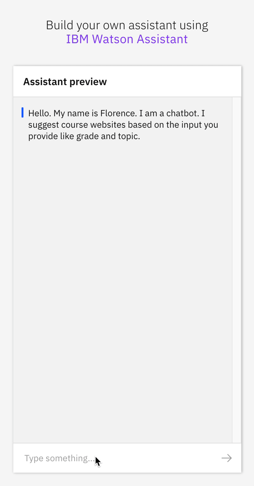
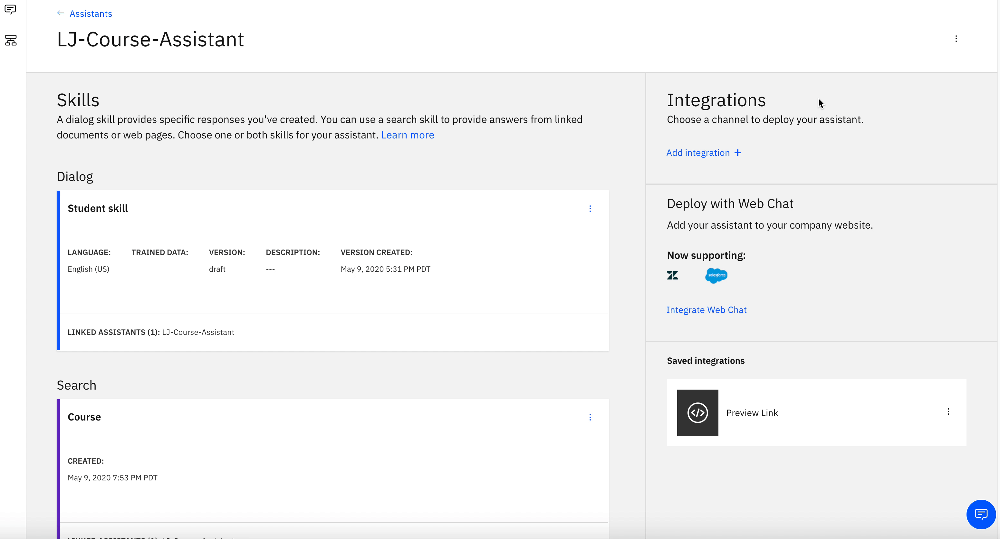

# Create a Chatbot experience to help students learning remotely to find courses and develop curriculums

<br>
<p align="center">
  
</p>
<br>


## Description
It is the year 2020 and students are experiencing a new way of life when it comes to getting an education. They are having to self-serve to fulfill their academic needs. Having access to an intelligent chat bot will help faciltate that process.  This pattern shows how to build a self-service platform that is applicable to not only education, but HR or other industry areas.

Using Watson Assistant, we will define a dialog to handle conversations between a student and course providers.  Students will ask for course recommendations that includes details about available course subjects.  We further enhance the conversation responses by using Watson Discovery via the Watson Assistant Search skill.  Natural Language Understanding (NLU) is introduced in this pattern to complement Watson Discovery's accuracy extracting custom fields for entities, concepts and categories.

### What is an Assistant Search Skill?

An Assistant search skill is a mechanism that allows you to directly query a Watson Discovery collection from your Assistant dialog. A search skill is triggered when the dialog reaches a node that has a search skill enabled. The user query is then passed to the Watson Discovery collection via the search skill, and the results are returned to the dialog for display to the user. Customizing how your documents are indexed into Discovery will improve the answers returned from queries.

Click [here](https://cloud.ibm.com/docs/assistant-data?topic=assistant-data-skill-search-add) for more information about the Watson Assistant search skill.

### Why NLU

NLU performs text analysis to extract meta-data such as concepts, entities, keywords and other types of categories of words. Data sets are then enriched with NLU-detected entities, keywords and concepts (e.g. course names, science).  Although Discovery provides great results, at times, a developer may find that the results are not getting the relevant results as one would like and may need to improve them. Discovery is built for "long-tail" use cases where the use case has many varied questions and results that you can't easily anticipate or optimize for. Additionally, if the corpus of documents is relatively small (less than 1000), Discovery doesn't have enough information to separate what terms might be important. Discovery can work with a copora this small - but it is less effective because it has less information about the relative frequency of terms in the domain you are working in.


## Flow

 

1. Manually seed `.xls` file with data from course offerings found on the web and add it to the Discovery Collection
2. Run script to run data set through Natural Language Understanding to extract the meta-data (e.g. course name, desciption,etc) and enrich the Discovery collection
3. The user interacts through the chatbot via a Watson Assistant Dialog Skill
4. When the student asks about course information, a search query is issued to the Watson Discovery service through a Watson Assistant search skill
5. Discovery has been enriched from the data set run through NLU. It returns responses to the dialog

## Included components

* [IBM Watson Assistant](https://www.ibm.com/cloud/watson-assistant/): Build, test and deploy a bot or virtual agent across mobile devices, messaging platforms, or even on a physical robot.
* [IBM Watson Discovery](https://www.ibm.com/watson/services/discovery/): A cognitive search and content analytics engine for applications to identify patterns, trends, and actionable insights.
* [IBM Watson Natural Language Understanding](https://www.ibm.com/watson/services/natural-language-understanding/): Analyze text to extract meta-data from content such as concepts, entities, keywords, categories, sentiment, emotion, relations, semantic roles, using natural language understanding.

## Featured technologies

* [Node.js Versions >= 6](https://nodejs.org/): An asynchronous event driven JavaScript runtime, designed to build scalable applications.
* [Python V3.5+](https://www.python.org/downloads/): Download the latest version of Python
* [Pandas](https://pandas.pydata.org/): pandas is a fast, powerful, flexible and easy to use open source data analysis and manipulation tool, built on top of the Python programming language. 


## Pre-requsites

* [IBM Cloud Account](https://cloud.ibm.com/).
* Basic familiarity of [IBM Cloud](https://cloud.ibm.com/), [Assistant service](https://cloud.ibm.com/docs/assistant?topic=assistant-getting-started), [Natural Language Understanding (NLU) service](https://cloud.ibm.com/docs/services/natural-language-understanding?topic=natural-language-understanding-getting-started#getting-started) and [Discovery service](https://cloud.ibm.com/docs/discovery?topic=discovery-getting-started).

## Steps

Follow these steps to setup and run this code pattern. The steps are described in detail below.

1. [Clone the Rep](#1-clone-the-repo)

2. [Create IBM Cloud services](#2-create-ibm-cloud-services)

3. [Configure Watson Natural Language Understanding](#3-configure-watson-nlu)

4. [Configure Watson Discovery](#4-configure-watson-discovery)

5. [Configure Watson Assistant and Test the Chatbot](#5-configure-watson-assistant-and-test-the-chatbot)

## 1. Clone the repo

```bash
git clone https://github.com/IBM/Education-SelfService-AI-Assistant
```

## 2. Create IBM Cloud services

Create the following services:

* [**Watson Discovery**](https://cloud.ibm.com/catalog/services/discovery)
* [**Watson Assistant**](https://cloud.ibm.com/catalog/services/assistant) 
* [**Watson Natural Language Understanding**](https://cloud.ibm.com/catalog/services/natural-language-understanding)

> **NOTE**: use the `Plus` offering of Watson Assistant. You have access to a 30 day trial.


## 3. Configure Watson NLU

NLU enriches Discovery by creating the addition of metadata tags to your data sets.  In otherwords, include terms that overlap with words that users will actually provide in their queries.

* Create a copy of the `env-sample` file and call it `.env`. Add in your NLU credentials. 

- The next step will run the [`.csv`](./data/discovery-nlu/input) files through NLU and extract entities and concepts. Do this by running the python program:  
```bash
cd src
pip install watson-developer-cloud==1.5
pip install --upgrade ibm-watson
pip install pandas
sudo pip3 install -U python-dotenv
python NLUEntityExtraction.py
```

> Note that this may take a few minutes. This will create 2 [`.csv`](./data/discovery-nlu/output) files. Take a look at the format by exploring the files.

- The last step to create a set `.json` files. This the format that Discovery accepts. Run a node program to convert the `.csv` file to a set of `.json` files in a directory named `manualdocs`.

-  Install [Node.js](https://nodejs.org) (Versions >= 6).

-  In the root directory of your repository, install the dependencies.
```bash
npm install
```

 - Run below command
 ```bash
 node read-file.js 
 ```
- Verify the [JSON](../manualdocs) files.


## 4. Configure Watson Discovery

### Create Discovery Collection

<br>
<p align="center">
  
</p>
<br>

* Find the Discovery service in your IBM Cloud Dashboard.
* Click on the service and then click on `Launch Watson Discovery`.
* Create a new data collection by hitting the `Upload your own data` button. You will see that you have one collection created that comes with Discovery by default. That is the `Watson Discovery News` collection. 
* Provide a collection name - call it `Courses`
* Select `English` language
* Click `Create`

* Use `Drag and drop your documents here or select documents` to seed the content with the documents in `./data/manualdocs/` of your cloned repo.

> Note that this may take a few minutes. You should see a total of 49 documents.

> **NOTE:** If using the Discovery Lite plan, you are limited to loading up to 1000 files into your discovery service. This limit is not per collection, but the combined number for all collections in your service.

## 5. Configure Watson Assistant and test the Chatbot

### Create assistant

* Find the Assistant service in your IBM Cloud Dashboard.

* Click on the service and then click on `Launch Watson Assistant`.

* Go to your Assistant tab and click `create assistant`. 


### Create Assistant dialog skill and test the chatbot

You will see that you now have the ability to add a:
* Dialog skill
* Search skill

<br>
<p align="center">
  
</p>
<br>

* Click on `Add dialog skill`

> **Note:** You will import the `Dialog skill` that is saved within this repo: `data/assistant/Student-skill-dialog.json`.

* Click on `Import Skill`

* Click on `Choose JSON File`. Go to your cloned repo dir, and `Open` the JSON file in `data/assistant/Student-skill-dialog.json`

* Click on `Import`

You will see that the dialog has been imported. Click on the words `Student-skill` and explore the dialog to see the intents, entities, dialog.  You can also add to the dialog to extend the conversation.

> **Note:** you can also create your dialog from scratch by selecting `Create skill` and adding in your own intents, entities and dialog.

### Create Assistant search skill

From your Assistant panel, click on `Add search skill`.

> **Note**: If you have provisioned Watson Assistant on IBM Cloud, the search skill is only offered on a paid plan, but a 30-day trial version is available if you click on the `Plus` button.

<br>
<p align="center">
  
</p>
<br>

From the `Add Search Skill` panel, select the `Create skill` tab.

Give your search skill a unique name, then click `Continue`.

From the search skill panel, select the Discovery service instance and collection you created previously.


> **Note** Assistant can only connect to 1 Discovery collection at a time.  You will use either the elementary or high school collections and then discovery will respond appropriately.

Click `Configure` to continue.

From the `Configure Search Response` panel, select `name` as the field to use for the `Title` of the response. Select `Description` as the field for the `Body` and select `URL` as the filled to use foor `URL`.  Click `Save` to complete the configuration.

Now when the dialog skill node invokes the search skill, the search skill will query the Discovery collection and display the text result to the user.

Learn more about the assistant search skill [here](https://cloud.ibm.com/docs/assistant?topic=assistant-skill-search-add)

### Enable search skill

* From your Assistant panel, click on the three dots in the upper right-hand corner and select `Settings`.

<br>
<p align="center">
  
</p>
<br>

* Select the `Search Skill` tab and ensure that is in `Enabled`.

> **NOTE**: The following feature is currently only available for Watson Assistant provisioned on IBM Cloud.

### Test out the Chatbot

Normally, you can test the dialog skill be selecting the `Try it` button located at the top right side of the dialog skill panel, but when integrated with a search skill, a different method of testing must be used.

<br>
<p align="center">
  
</p>
<br>

From your assistant panel, select `Add Integrations`.

From the list of available integration types, select `Preview link`.

From the `Preview link integration` panel, name your preview link and click `Create`.

If you click on the generated URL link, you will be able to interact with your dialog skill. Note that the input "Can you recommend a math class?" has triggered our `Which grade do you want recommendation for` dialog node and invoked our search skill.


## Troubleshooting

* Error: If you get an error that says you 
      > Traceback (most recent call last):
      > File "NLUEntityExtraction.py", line 4, in <module>
      > import pandas as pd
      > ImportError: No module named pandas

      > you need to make sure you are using the same verion of pip and python.  We recommend you use Python 3 and Pip 3

* Error: Unable to list workspaces for Watson Assistant: Forbidden: Access is denied due to invalid credentials.

  > This error occurs with `Deploy to IBM Cloud` button. Configure a runtime environment variable for `ASSISTANT_APIKEY` to allow automatic configuration of the default skill or configure `SKILL_ID` to use another skill.

* Error: Only one free environment is allowed per organization

  > To work with a free trial, a small free Discovery environment is created. If you already have a Discovery environment, this will fail. If you are not using Discovery, check for an old service thay you may want to delete. Otherwise use the .env DISCOVERY_ENVIRONMENT_ID to tell the app which environment you want it to use. A collection will be created in this environment using the default configuration.


# Related Links

- [How to get the most out of Relevancy Training](https://developer.ibm.com/dwblog/2017/get-relevancy-training/)
- [Improving result relevance with the API](https://cloud.ibm.com/docs/discovery?topic=discovery-improving-result-relevance-with-the-api)

# Learn more

* **Artificial Intelligence Code Patterns**: Enjoyed this code pattern? Check out our other [AI Code Patterns](https://developer.ibm.com/technologies/artificial-intelligence/).
* **AI and Data Code Pattern Playlist**: Bookmark our [playlist](https://www.youtube.com/playlist?list=PLzUbsvIyrNfknNewObx5N7uGZ5FKH0Fde) with all of our code pattern videos
* **With Watson**: Want to take your Watson app to the next level? Looking to utilize Watson Brand assets? [Join the With Watson program](https://www.ibm.com/watson/with-watson/) to leverage exclusive brand, marketing, and tech resources to amplify and accelerate your Watson embedded commercial solution.


# License

This code pattern is licensed under the Apache Software License, Version 2.  Separate third party code objects invoked within this code pattern are licensed by their respective providers pursuant to their own separate licenses. Contributions are subject to the [Developer Certificate of Origin, Version 1.1 (DCO)](https://developercertificate.org/) and the [Apache Software License, Version 2](https://www.apache.org/licenses/LICENSE-2.0.txt).

[Apache Software License (ASL) FAQ](https://www.apache.org/foundation/license-faq.html#WhatDoesItMEAN)
